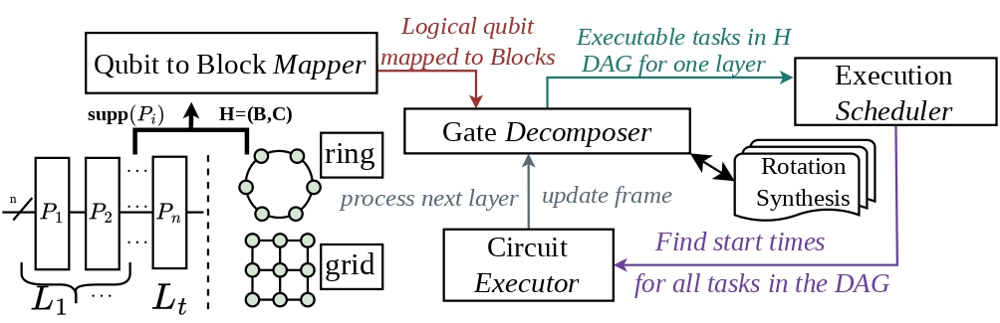
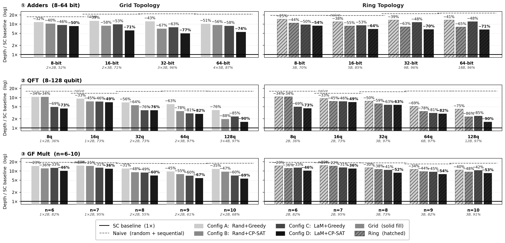
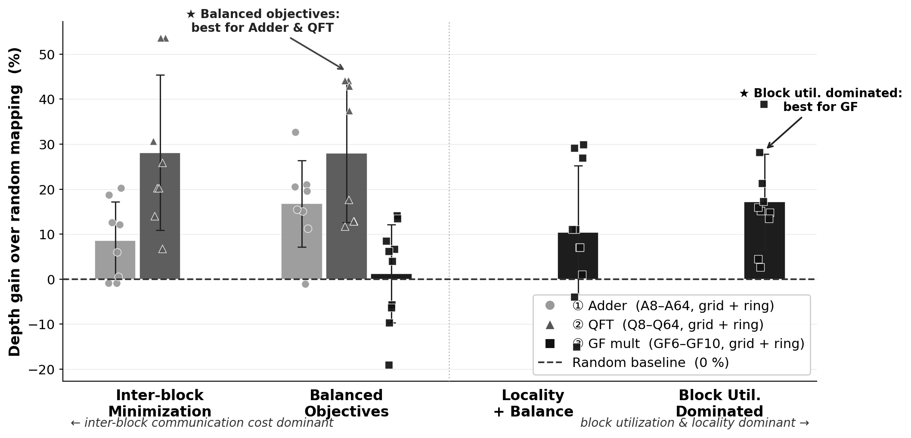

# LaMDaMS — Locality-aware Mapping and Dependency-aware Measurement Scheduling

End-to-end compiler and scheduler for quantum circuits through **Pauli-Based Computation (PBC)** on lattice-surgery hardware (Gross code).

Given a quantum circuit, lamdams maps logical qubits to hardware blocks, decomposes Pauli rotations into native operations, schedules them under hardware constraints, and reports the resulting logical circuit depth; the primary cost metric for fault-tolerant execution.

---



---

## Install

```bash
pip install -e .
```

---

## Pipeline

The compiler runs six stages, each printed to the terminal as it executes:

```
QASM  →  Frontend  →  Hardware  →  Qubit-to-Block Mapping  →  Gate Decomposition  →  Execution Scheduling  →  depth
```

| Stage | What happens |
|-------|-------------|
| **Frontend** | Converts QASM to a Pauli-product rotation sequence via the Litinski transform (lsqecc) |
| **Hardware** | Builds a grid or ring topology from Gross-code blocks at the requested fill rate |
| **Qubit-to-Block Mapping** | Assigns logical qubits to physical hardware blocks, random or via **LaM** |
| **Gate Decomposition** | Decomposes each Pauli layer into a native-gate dependency graph (DAG) |
| **Execution Scheduling** | Assigns time-steps to DAG nodes subject to hardware coupler constraints |
| **Circuit Executor** | Propagates Clifford frame corrections across layers; accumulates logical depth |

Running `python run_compile.py Adder8 --config C` produces:

```
[frontend]  n_qubits=23  t_count=266  n_layers=3
[hardware]  2×2 (4B, 52% fill)  blocks=4  couplers=4
[mapping]   simulated_annealing  [family=adder] ... done
[schedule]  greedy_critical  ... done
[result]    logical_depth=2,518
```
output files stored at runs\Adder8__C__seed***
---

## Quick start

```bash
pip install -e .

python run_compile.py --list                          # see available circuits
python run_compile.py Adder8                          # run default config (A)
python run_compile.py Adder8 --config C               # LaM + greedy scheduling
python run_compile.py Adder8 --config D               # LaM + CP-SAT  (best depth)
```

---

## Two entry points

| Script | Purpose |
|--------|---------|
| `run_compile.py` | Compile and run **one circuit** end-to-end |
| `run_experiment.py` | Batch evaluation across all 5 configs × 2 topologies |

---

## Configurations

The five configs isolate the contribution of each component, from a random baseline to the full algorithm.

| Config | Qubit-to-Block Mapping | Execution Scheduling | Role |
|--------|------------------------|----------------------|------|
| `naive` | Random | Sequential | baseline — no optimisation |
| `A` | Random | Greedy | scheduling only |
| `B` | Random | CP-SAT | scheduling upper bound |
| `C` | **LaM** | Greedy | mapping + scheduling |
| `D` | **LaM** | CP-SAT | full algorithm — best depth |

**LaM** (Locality-Aware Mapping) is our simulated-annealing mapper with hyperparameters tuned per circuit family. Config D reduces logical depth by **50–77%** over the naive baseline across the Adder family (grid topology, seed 42).

---

## run_compile.py — single circuit

```bash
python run_compile.py --help
python run_compile.py --list

# Run a pre-compiled circuit by name
python run_compile.py Adder8
python run_compile.py Adder8  --config D
python run_compile.py Adder8  --config C --topology ring

# Compile from QASM — compiled once, cached in circuits/compiled/ for reuse
python run_compile.py circuits/Test/example.qasm
python run_compile.py circuits/Test/rand_10q_100t.qasm --config C --seed 7

# Family weights are auto-detected from the circuit name for configs C/D
python run_compile.py gf8_mult   --config C             # → gf   weights
python run_compile.py QFT64      --config D             # → qft  weights
python run_compile.py Adder32    --config C --family adder   # explicit override
```

**Key flags:**

| Flag | Default | Description |
|------|---------|-------------|
| `--config {naive,A,B,C,D}` | `A` | Preset mapping + scheduling configuration |
| `--topology {grid,ring}` | `grid` | Hardware graph topology |
| `--family {adder,qft,gf,rand}` | auto-detected | SA score weights for LaM (configs C/D) |
| `--seed N` | `42` | Random seed |

**Output — two files per run:**

```
runs/<circuit>__<config>__seed<N>__<timestamp>/
  result.json    — circuit stats, hardware config, depth, timing
  trace.ndjson   — per-stage event log (newline-delimited JSON)
```

---

## run_experiment.py — batch evaluation

Runs all 5 configs × grid and ring topologies for one circuit in a single command.

```bash
python run_experiment.py --help
python run_experiment.py --list

# Single circuit, default seed (42)
python run_experiment.py --circuit Adder8

# Custom seed and CP-SAT time limit per layer
python run_experiment.py --circuit QFT32 --seed 1 --cp-time 300

# GF family with tuned score weights
python run_experiment.py --circuit gf8_mult --family gf

# Re-run even if result file already exists
python run_experiment.py --circuit Adder16 --force
```

Results are written to:

```
results/raw/<circuit>_seed<N>.json
```

Each result file contains depth and timing for all 5 configs × 2 topologies, ready for figure generation with `experiments/gen_fig_families.py` and `experiments/gen_fig_sensitivity.py`.

---

## Results

### Depth scaling across circuit families

Logical depth across the Adder, QFT, GF-multiplication, and random circuit families for all five configs on both grid and ring topologies. Config D (LaM + CP-SAT) consistently achieves the lowest depth across all families.



To reproduce:

```bash
# Run all circuits in each family (both topologies, all 5 configs)
python run_experiment.py --circuit Adder8    --family adder
python run_experiment.py --circuit Adder16   --family adder
python run_experiment.py --circuit Adder32   --family adder
python run_experiment.py --circuit Adder64   --family adder
python run_experiment.py --circuit Adder128  --family adder

python run_experiment.py --circuit QFT8     --family qft
python run_experiment.py --circuit QFT16    --family qft
python run_experiment.py --circuit QFT32    --family qft
python run_experiment.py --circuit QFT64    --family qft
python run_experiment.py --circuit QFT128   --family qft

python run_experiment.py --circuit gf6_mult --family gf
python run_experiment.py --circuit gf8_mult --family gf
python run_experiment.py --circuit gf10_mult --family gf
```

```bash
python experiments/gen_fig_families.py
```

---

### Sensitivity analysis

LaM uses a weighted scoring function during simulated annealing. The figure below shows how depth changes as each weight is varied independently, validating the tuned values used in configs C and D.



To reproduce:

```bash
python run_experiment.py --circuit Adder8   --family adder
python run_experiment.py --circuit QFT32    --family qft
python run_experiment.py --circuit gf8_mult --family gf
```

```bash
python experiments/gen_fig_sensitivity.py
```

> **Note:** Optimal LaM performance requires family-specific scoring weights. The GF-multiplication family, for example, needs suppressed span weights to prevent SA from over-optimising span at the cost of occupancy balance. Use `--family` to activate the tuned weights for your circuit family when running configs C or D.

---

## Available circuits

Pre-compiled circuits in `circuits/compiled/`. Run `python run_compile.py --list` for the full list.

| Family | Circuits |
|--------|----------|
| **Adder** | Adder8, Adder16, Adder32, Adder64, Adder128 |
| **QFT** | QFT8, QFT16, QFT32, QFT64, QFT128 |
| **GF-mult** | gf6_mult, gf7_mult, gf8_mult, gf9_mult, gf10_mult |
| **Random** | rand_50q_500t_s42, rand_50q_1kt_s42, rand_50q_1500t_s42, rand_50q_2kt_s42 |
| **Random (large)** | rand_60q_4kt_s42, rand_70q_6kt_s42, rand_80q_8kt_s42, rand_100_10k |

To add your own circuit:

```bash
python run_compile.py path/to/circuit.qasm --config C
# PBC is compiled and cached in circuits/compiled/ automatically
```

---

## Project layout

```
run_compile.py          single-circuit entry point
run_experiment.py       batch evaluation entry point
modqldpc/
  frontend/             QASM → PBC  (Litinski transform via lsqecc)
  mapping/              qubit-to-block mapping algorithms  (LaM, random, …)
  scheduling/           execution scheduling algorithms  (greedy, CP-SAT, …)
  lowering/             gate decomposition  (Pauli layer → native-gate DAG)
  runtime/              Clifford frame tracking and layer execution
  pipeline/             pipeline orchestration and profiling
circuits/
  compiled/             pre-compiled PBC circuits  (.json, reused across runs)
  benchmarks/           external QASM benchmark suites  (Nam, QMAP, staq)
  Test/                 small test circuits for quick verification
experiments/            figure generation and sensitivity analysis scripts
results/
  figures/              publication figures
  raw/                  per-circuit JSON results from run_experiment.py
```

---

## Citation

```bibtex
@article{lamdams2025,
  title   = {},
  author  = {},
  journal = {},
  year    = {2025},
}
```
